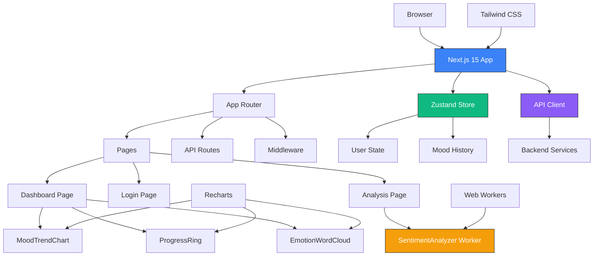

# Frontend Architecture Diagram

## Component Relationships

### Page Components
- **Dashboard Page**: Main application view with mood tracking visualizations
- **Login Page**: Authentication interface
- **Analysis Page**: Text sentiment analysis interface

### Visualization Components
- **MoodTrendChart**: Recharts-based line chart for mood progression
- **ProgressRing**: SVG-based circular progress indicators
- **EmotionWordCloud**: Dynamic text visualization of emotions

### State Management
- **Zustand Store**: Centralized state management
  - User authentication state
  - Mood history data
  - UI state (loading, errors)

### Data Layer
- **API Client**: Axios-based HTTP client for backend communication
- **Web Workers**: Background processing for sentiment analysis

### Styling & Utilities
- **Tailwind CSS**: Utility-first CSS framework
- **Recharts**: Declarative charting library
- **Middleware**: Authentication and routing logic

## Data Flow

1. User interacts with UI components
2. Actions update Zustand store
3. Components re-render based on state changes
4. API client fetches data from backend services
5. Web Workers process intensive computations
6. Results are displayed through visualization components

## Performance Considerations

- Server-Side Rendering for initial page load
- Client-side hydration for interactivity
- Web Workers for non-blocking computations
- Code splitting for lazy loading
- Responsive design for all devices